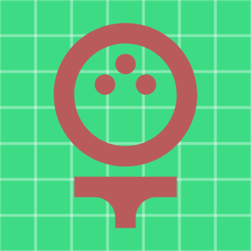

# Detail_AR

    

<h3 align="center">Detail_AR Project</h3>

------

### OverView

This is an argumented reality Android app that helps 4-ball pool game beginner.

This app can detect the position of billiard balls and table and then show you billiard solution path with argumented objects such as arrows, circles.

Solutions show how target ball hits two red balls with hitting the wall or directly. 

You can use the app easily by following the steps below.

- Just show the 4-corners of Billiard Table into APK camera frame.
- When Detection is completed, Click the button `인식`.
  - After 4-conrners detection are completed, you can free to walk around the billiard table.
- You can see the path of billiard solution with argumented object.
- If you want to change the target ball color you want to hit, Click the button  `색 변경`.
- If you want to see other path, Click the button  `경로 변경`.
- You should click the button `리셋` after hit the balls or the position of balls is changed.

-----

### Test Gif with APK

#### Solution with not hitting the wall

#### Solution with hitting the wall

#### Solution with changing color & path

-----

### Feature

- Android Studio with NDK
- CMake
- OpenCV

------

### License

Distributed under the MIT License. See `LICENSE` for more information.
